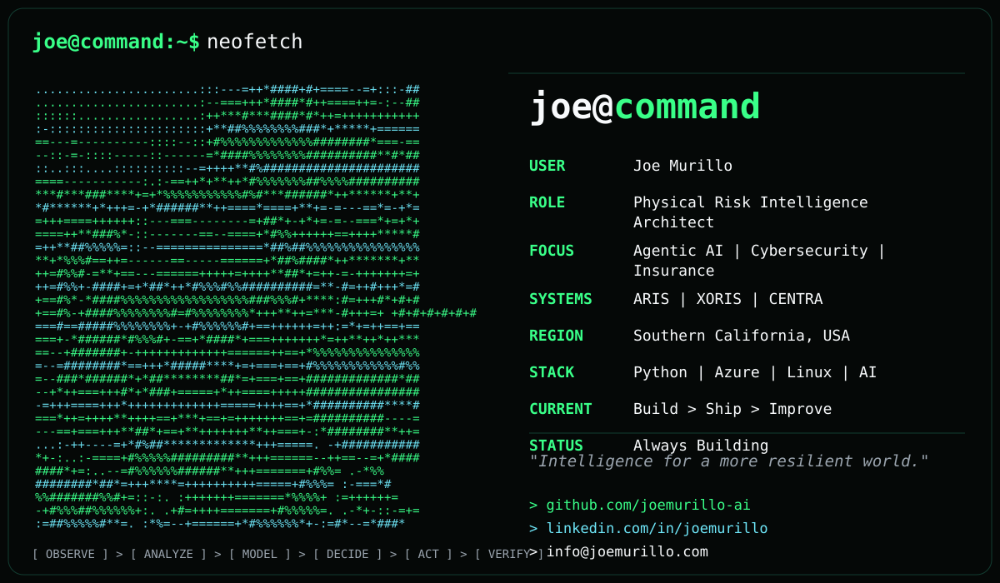
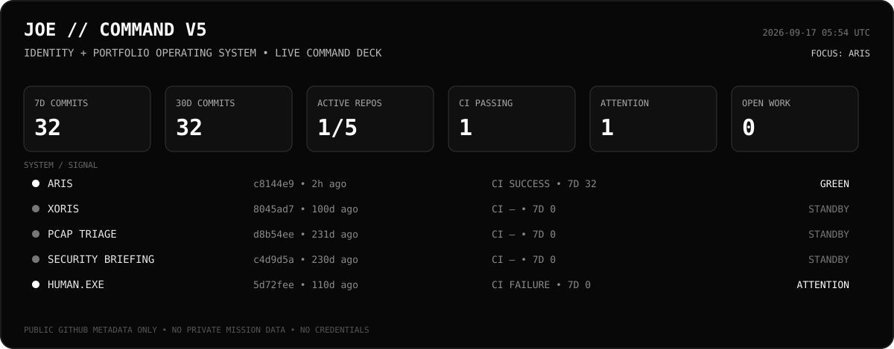
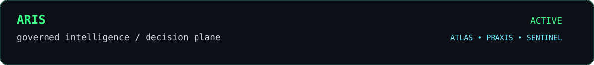
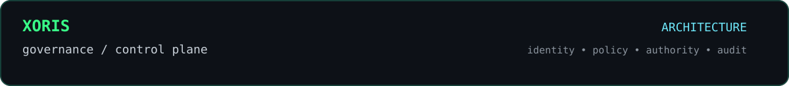
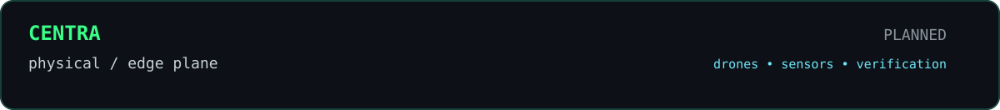
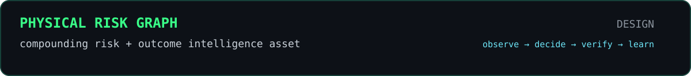

<p align="center">
  
</p>

<p align="center">
  <strong>JOE // COMMAND</strong><br/>
  <sub>PHYSICAL RISK INTELLIGENCE • AGENTIC AI • CYBERSECURITY • INSURANCE • AUTONOMOUS SYSTEMS</sub>
</p>

<p align="center">
  
</p>

> **Building governed intelligence infrastructure for the physical world — systems that help humans and machines observe, reason, decide, act, verify, and learn.**

```text
joe@command:~$ identity --public

name         Joe Murillo
role         Physical Risk Intelligence Architect
focus        Agentic AI / Cybersecurity / Insurance / Physical Risk
building     ARIS / XORIS / CENTRA / Physical Risk Graph
industry     Commercial Insurance / Loss Control / Risk Engineering
employer     Pennsylvania Lumbermens Mutual
region       Southern California, USA
protocol     OBSERVE → ANALYZE → MODEL → DECIDE → ACT → VERIFY
status       ALWAYS BUILDING
```

---

## `joe@command:~$ cat architecture.sys`

```text
JOE
└── XORIS  ── governance / control plane
    └── ARIS ── intelligence / decision plane
        ├── ATLAS     establish what is true
        ├── PRAXIS    plan what should be done
        └── SENTINEL  challenge assumptions / confidence / security
            └── CENTRA ── physical / edge plane
                └── PHYSICAL RISK GRAPH
```

**XORIS** owns authority, identity, missions, capabilities, policy, human approvals, trust, quarantine, kill switches, observability, and audit.  
**ARIS** reasons. **CENTRA** senses and verifies the physical world. The **Physical Risk Graph** is the compounding outcome asset.

---

## `joe@command:~$ pulse --portfolio`

<!-- V5:PULSE:START -->
```text
PORTFOLIO PULSE
----------------------------------------------------------------
commits_7d           0
commits_30d          38
active_repos_30d     1/5
ci_success           1
attention_signals    1
open_prs             0
open_issues          0
focus_repo           ARIS
```
<!-- V5:PULSE:END -->

---

## `joe@command:~$ trust --surface`

Operational signal only — **not a security rating**. It combines public commit recency, CI state, and visible work pressure.

<!-- V5:TRUST:START -->
| System | Activity | CI | Work pressure | Operational signal |
|---|---|---|---|---|
| ARIS | ACTIVE | SUCCESS | CLEAR | GREEN |
| XORIS | DORMANT | — | CLEAR | STANDBY |
| PCAP TRIAGE | DORMANT | — | CLEAR | STANDBY |
| SECURITY BRIEFING | DORMANT | — | CLEAR | STANDBY |
| HUMAN.EXE | ATTENTION | FAILURE | CLEAR | ATTENTION |
<!-- V5:TRUST:END -->

---

## `joe@command:~$ queue --public`

Public execution queue derived from open pull requests and issues across the tracked portfolio.

<!-- V5:QUEUE:START -->
```text
QUEUE CLEAR — no open public PRs or issues across tracked repositories.
```
<!-- V5:QUEUE:END -->

---

## `joe@command:~$ telemetry --live`

Regenerated automatically from **public GitHub metadata** every six hours.

<!-- V5:TELEMETRY:START -->
| System | Branch | Head | Last commit | 7d | 30d | PRs | Issues | Latest Action | Signal |
|---|---|---:|---:|---:|---:|---:|---:|---|---|
| ARIS | `main` | `64cef72` | 7d ago | 0 | 38 | 0 | 0 | SUCCESS | ACTIVE |
| XORIS | `master` | `8045ad7` | 107d ago | 0 | 0 | 0 | 0 | — | DORMANT |
| PCAP TRIAGE | `main` | `d8b54ee` | 238d ago | 0 | 0 | 0 | 0 | — | DORMANT |
| SECURITY BRIEFING | `main` | `c4d9d5a` | 237d ago | 0 | 0 | 0 | 0 | — | DORMANT |
| HUMAN.EXE | `main` | `5d72fee` | 118d ago | 0 | 0 | 0 | 0 | FAILURE | ATTENTION |

`telemetry_sync: 2026-09-24 21:30 UTC`  
`boundary: public GitHub metadata only`
<!-- V5:TELEMETRY:END -->

---

## `joe@command:~$ tail -n 12 mission.log`

<!-- V5:MISSION_LOG:START -->
| UTC | System | Mission event | Commit |
|---|---|---|---|
| 2026-09-17 21:02 | `aris` | Merge pull request #12 from joemurillo-ai/chore/reconcile-persisted-exe… | `64cef72` |
| 2026-09-17 21:00 | `aris` | chore: reconcile persisted execution roadmap | `181cff9` |
| 2026-09-17 20:41 | `aris` | Merge pull request #11 from joemurillo-ai/agent/persisted-execution | `b6a884f` |
| 2026-09-17 20:37 | `aris` | feat: execute persisted missions | `cc83931` |
| 2026-09-17 20:06 | `aris` | Merge pull request #10 from joemurillo-ai/chore/reconcile-agent-authori… | `48491a5` |
| 2026-09-17 20:04 | `aris` | chore: reconcile agent authorization roadmap | `6398090` |
| 2026-09-17 03:25 | `aris` | feat: enforce mission agent authorization (#9) | `c8144e9` |
| 2026-09-17 02:59 | `aris` | chore: reconcile governance events roadmap status (#8) | `5b38a76` |
| 2026-09-16 22:01 | `aris` | feat: add durable governance event history (#7) | `9a66715` |
| 2026-09-16 17:58 | `aris` | chore: reconcile privacy redaction roadmap status (#6) | `fa8f419` |
| 2026-09-16 17:04 | `aris` | feat: add bounded diagnostic redaction (#5) | `62bcf0e` |
| 2026-09-15 23:03 | `aris` | chore: reconcile lifecycle roadmap status | `fa18b8f` |
<!-- V5:MISSION_LOG:END -->

---

## `joe@command:~$ show_nodes --fabric`

```text
NODE 01  SENTINEL   Linux / Omarchy          ONLINE
         └─ security • infrastructure • SSH • Tailscale

NODE 02  WINDOWS    Microsoft / Enterprise   ACTIVE
         └─ GitHub • VS Code • Copilot • Power Platform • Azure

NODE 03  macOS      Apple dev cockpit        PLANNED
NODE 04  ATLAS      AI / GPU compute         PLANNED
NODE 05  VAULT      storage / artifacts      PLANNED
NODE 06  CENTRA     physical / edge          PLANNED
NODE 07  MOBILE     iPhone / iPad ops        ACTIVE
NODE 08  LAB        adversarial sandbox      PLANNED
```

---

## `joe@command:~$ ls ./systems`

<a href="https://github.com/joemurillo-ai/aris"></a>

<a href="https://github.com/joemurillo-ai/xoris-ai"></a>





### `joe@command:~$ ls ./spotlight`

<a href="https://github.com/joemurillo-ai/aris"></a>  `governed mission execution • lifecycle • authorization • audit`

<a href="https://github.com/joemurillo-ai/xoris-ai"></a>  `governance • control plane • identity • policy`

<a href="https://github.com/joemurillo-ai/pcap-triage-pipeline"></a>  `network evidence → analysis → incident-ready reporting`

<a href="https://github.com/joemurillo-ai/azure-ai-security-briefing-agent"></a>  `AI-powered security briefing workflows`

<a href="https://github.com/joemurillo-ai/humanexe"></a>  `human execution and workflow experiments`

---

## `joe@command:~$ cat doctrine.txt`

```text
01  BUILD DIGITAL TWINS OF FUNCTIONS — NOT DIGITAL TWINS OF PEOPLE.
02  HUMAN AUTHORITY > AGENT AUTHORITY.
03  NO AUTONOMY WITHOUT IDENTITY, POLICY, AUTHORIZATION,
    OBSERVABILITY, AUDIT, AND REVERSIBILITY.
04  HARDWARE IS REPLACEABLE.
05  MODELS ARE REPLACEABLE.
06  THE DRONE IS A SENSOR. THE MODEL IS A PERCEPTION LAYER.
07  VERIFIED OUTCOME DATA COMPOUNDS.
```

---

## `joe@command:~$ contact --show`

```text
GitHub     github.com/joemurillo-ai
LinkedIn   linkedin.com/in/joemurillo
Email      info@joemurillo.com
```

<p align="center">
  <sub>JOE // COMMAND • terminal green • mobile-first command surface • live telemetry • governed autonomy</sub>
</p>
