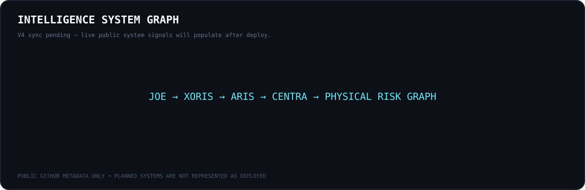

<p align="center">
  
</p>

<p align="center">
  <strong>JOE // COMMAND V4</strong><br/>
  <sub>PORTFOLIO OPERATING SYSTEM • PHYSICAL RISK INTELLIGENCE • AGENTIC AI • CYBERSECURITY • INSURANCE</sub>
</p>

<p align="center">
  
</p>

> **Building intelligence infrastructure that allows humans and machines to understand, measure, govern, and reduce physical risk.**

```text
joe@command:~$ boot --v4

identity     Joe Murillo
role         Physical Risk Intelligence Architect
mission      Intelligence infrastructure for the physical world
control      XORIS
reasoning    ARIS / ATLAS / PRAXIS / SENTINEL
physical     CENTRA
asset        Physical Risk Graph
node_01      SENTINEL — Linux / Omarchy
node_02      WINDOWS — enterprise / engineering
protocol     OBSERVE → DECIDE → ACT → VERIFY → LEARN
status       PORTFOLIO OPERATING SYSTEM ONLINE
```

---

## `joe@command:~$ graph --system`

<p align="center">
  
</p>

```text
JOE
└── XORIS  ── governance / control plane
    └── ARIS ── intelligence / decision plane
        ├── ATLAS     establish what is true
        ├── PRAXIS    plan what should be done
        └── SENTINEL  challenge assumptions / confidence / security
            └── CENTRA ── physical / edge plane
                └── PHYSICAL RISK GRAPH
```

**XORIS** owns authority, identity, missions, capabilities, policy, human approvals, trust, quarantine, kill switches, observability, and audit.  
**ARIS** reasons. **CENTRA** senses and verifies the physical world. The **Physical Risk Graph** is the compounding outcome asset.

---

## `joe@command:~$ pulse --portfolio`

<!-- V4:PULSE:START -->
```text
PORTFOLIO PULSE
----------------------------------------------------------------
commits_7d           32
commits_30d          32
active_repos_30d     1/5
ci_success           1
attention_signals    1
open_prs             0
open_issues          0
focus_repo           ARIS
```
<!-- V4:PULSE:END -->

---

## `joe@command:~$ trust --surface`

Operational signal only — **not a security rating**. It combines public commit recency, CI state, and visible work pressure.

<!-- V4:TRUST:START -->
| System | Activity | CI | Work pressure | Operational signal |
|---|---|---|---|---|
| ARIS | ACTIVE | SUCCESS | CLEAR | GREEN |
| XORIS | DORMANT | — | CLEAR | STANDBY |
| PCAP TRIAGE | DORMANT | — | CLEAR | STANDBY |
| SECURITY BRIEFING | DORMANT | — | CLEAR | STANDBY |
| HUMAN.EXE | DORMANT | FAILURE | CLEAR | ATTENTION |
<!-- V4:TRUST:END -->

---

## `joe@command:~$ queue --public`

Public execution queue derived from open pull requests and issues across the tracked portfolio.

<!-- V4:QUEUE:START -->
```text
QUEUE CLEAR — no open public PRs or issues across tracked repositories.
```
<!-- V4:QUEUE:END -->

---

## `joe@command:~$ telemetry --live`

Regenerated automatically from **public GitHub metadata** every six hours.

<!-- V4:TELEMETRY:START -->
| System | Branch | Head | Last commit | 7d | 30d | PRs | Issues | Latest Action | Signal |
|---|---|---:|---:|---:|---:|---:|---:|---|---|
| [ARIS](https://github.com/joemurillo-ai/aris) | `main` | `c8144e9` | 1h ago | 32 | 32 | 0 | 0 | SUCCESS | ACTIVE |
| [XORIS](https://github.com/joemurillo-ai/xoris-ai) | `master` | `8045ad7` | 100d ago | 0 | 0 | 0 | 0 | — | DORMANT |
| [PCAP TRIAGE](https://github.com/joemurillo-ai/pcap-triage-pipeline) | `main` | `d8b54ee` | 231d ago | 0 | 0 | 0 | 0 | — | DORMANT |
| [SECURITY BRIEFING](https://github.com/joemurillo-ai/azure-ai-security-briefing-agent) | `main` | `c4d9d5a` | 230d ago | 0 | 0 | 0 | 0 | — | DORMANT |
| [HUMAN.EXE](https://github.com/joemurillo-ai/humanexe) | `main` | `5d72fee` | 110d ago | 0 | 0 | 0 | 0 | FAILURE | ATTENTION |

`boundary: public GitHub metadata only`
<!-- V4:TELEMETRY:END -->

---

## `joe@command:~$ tail -n 12 mission.log`

<!-- V4:MISSION_LOG:START -->
| UTC | System | Mission event | Commit |
|---|---|---|---|
| 2026-09-17 03:25 | `aris` | feat: enforce mission agent authorization (#9) | [`c8144e9`](https://github.com/joemurillo-ai/aris/commit/c8144e93a307ca961437aa5d316cdd8a4a1f3a1f) |
| 2026-09-17 02:59 | `aris` | chore: reconcile governance events roadmap status (#8) | [`5b38a76`](https://github.com/joemurillo-ai/aris/commit/5b38a76241f14c9b7c193b628db8f7d293f68d63) |
| 2026-09-16 22:01 | `aris` | feat: add durable governance event history (#7) | [`9a66715`](https://github.com/joemurillo-ai/aris/commit/9a667153c9422e9e9d498e79d58b5acc79810436) |
<!-- V4:MISSION_LOG:END -->

---

## `joe@command:~$ show_nodes --fabric`

```text
NODE 01  SENTINEL   Linux / Omarchy          ONLINE
         └─ security • infrastructure • SSH • Tailscale

NODE 02  WINDOWS    Microsoft / Enterprise   ACTIVE
         └─ GitHub • VS Code • Copilot • Power Platform • Azure

NODE 03  macOS      Apple dev cockpit        PLANNED
NODE 04  ATLAS      AI / GPU compute         PLANNED
NODE 05  VAULT      storage / artifacts      PLANNED
NODE 06  CENTRA     physical / edge          PLANNED
NODE 07  MOBILE     iPhone / iPad ops        ACTIVE
NODE 08  LAB        adversarial sandbox      PLANNED
```

---

## `joe@command:~$ ls ./systems`

| System | Role | State |
|---|---|---|
| [`ARIS`](https://github.com/joemurillo-ai/aris) | Governed intelligence / decision plane | **ACTIVE** |
| [`XORIS`](https://github.com/joemurillo-ai/xoris-ai) | Governance / control plane | **ARCHITECTURE** |
| **CENTRA** | Physical / edge plane | **PLANNED** |
| **Physical Risk Graph** | Compounding risk + outcome data asset | **DESIGN** |

### `./spotlight`

| Repository | Mission |
|---|---|
| [`aris`](https://github.com/joemurillo-ai/aris) | Governed mission execution, lifecycle policy, authorization, audit, and agent-ready engineering |
| [`xoris-ai`](https://github.com/joemurillo-ai/xoris-ai) | Governance and control-plane architecture |
| [`pcap-triage-pipeline`](https://github.com/joemurillo-ai/pcap-triage-pipeline) | Network evidence → analysis → incident-ready reporting |
| [`azure-ai-security-briefing-agent`](https://github.com/joemurillo-ai/azure-ai-security-briefing-agent) | AI-powered security briefing workflows |
| [`humanexe`](https://github.com/joemurillo-ai/humanexe) | Human execution and workflow experiments |

---

## `joe@command:~$ cat doctrine.txt`

```text
01  BUILD DIGITAL TWINS OF FUNCTIONS — NOT DIGITAL TWINS OF PEOPLE.
02  HUMAN AUTHORITY > AGENT AUTHORITY.
03  NO AUTONOMY WITHOUT IDENTITY, POLICY, AUTHORIZATION,
    OBSERVABILITY, AUDIT, AND REVERSIBILITY.
04  HARDWARE IS REPLACEABLE.
05  MODELS ARE REPLACEABLE.
06  THE DRONE IS A SENSOR. THE MODEL IS A PERCEPTION LAYER.
07  VERIFIED OUTCOME DATA COMPOUNDS.
```

---

## `joe@command:~$ ./contribution_signal`

<picture>
  <source media="(prefers-color-scheme: dark)" srcset="https://raw.githubusercontent.com/joemurillo-ai/joemurillo-ai/output/github-contribution-grid-snake-dark.svg">
  <source media="(prefers-color-scheme: light)" srcset="https://raw.githubusercontent.com/joemurillo-ai/joemurillo-ai/output/github-contribution-grid-snake.svg">
  
</picture>

---

## `joe@command:~$ contact --show`

```text
GitHub     github.com/joemurillo-ai
LinkedIn   linkedin.com/in/joemurillo
Email      info@joemurillo.com
```

<p align="center">
  <sub>JOE // COMMAND V4 • portfolio operating system • command deck • trust surface • execution queue • live telemetry</sub>
</p>
