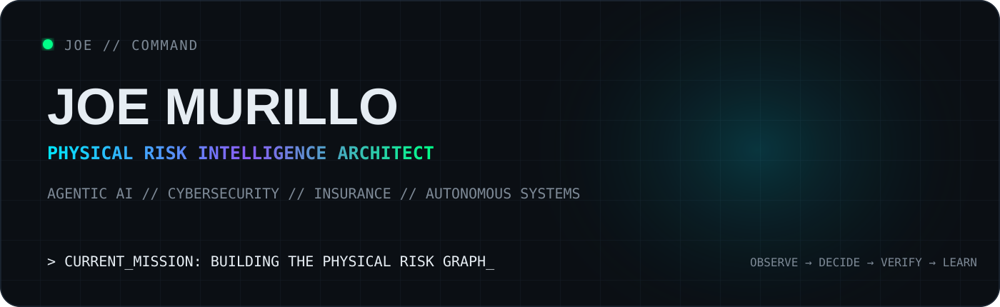
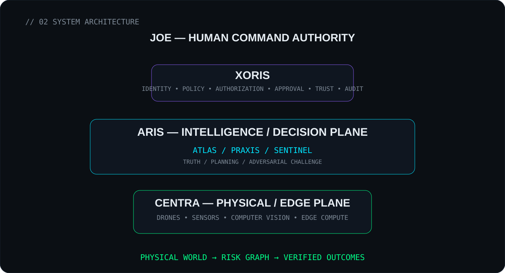
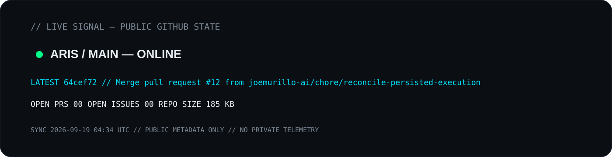
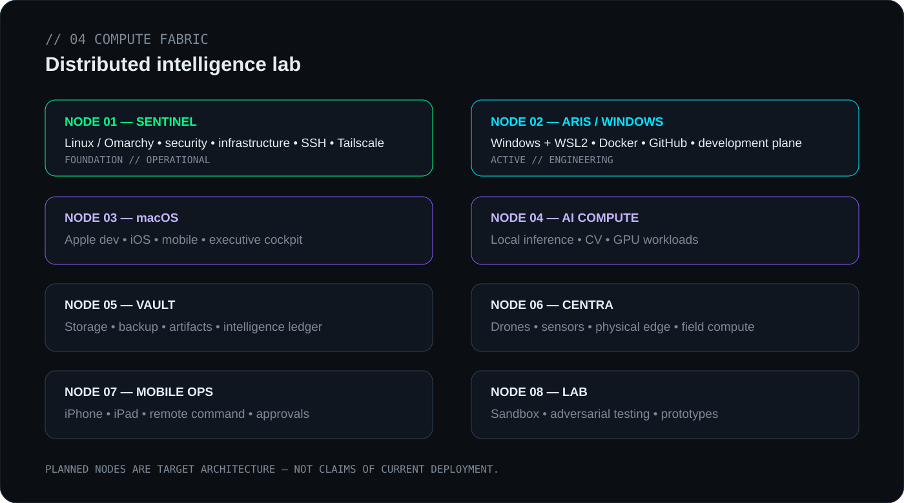
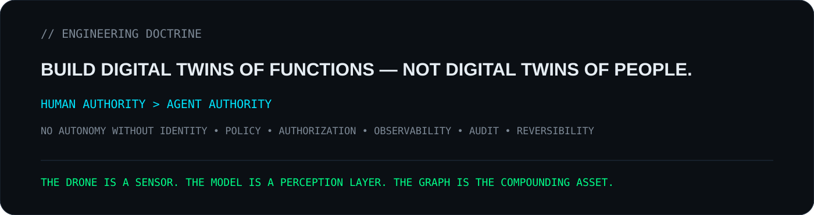

<p align="center">
  
</p>

<p align="center">
  <a href="https://github.com/joemurillo-ai/aris"><b>ARIS</b></a>
  &nbsp;•&nbsp; Agentic AI
  &nbsp;•&nbsp; Cybersecurity
  &nbsp;•&nbsp; Insurance
  &nbsp;•&nbsp; Physical Risk Intelligence
</p>

---

## `01 // MISSION`

I’m building **intelligence infrastructure for the physical world** — systems that allow humans and machines to understand, measure, govern, and reduce physical risk.

> **Observation → Risk → Decision → Action → Verification → Outcome**

The long-term asset is not a single model, drone, or application. It is the continuously improving **Physical Risk Graph** produced by governed observation, decisions, remediation, verification, and outcomes.

---

## `02 // SYSTEM ARCHITECTURE`

<p align="center">
  
</p>

**JOE** is human command authority.  
**XORIS** governs identity, missions, permissions, approval, trust, audit, and enforcement.  
**ARIS** reasons. **ATLAS** establishes what is true. **PRAXIS** plans. **SENTINEL** challenges assumptions, confidence, and security.  
**CENTRA** senses and verifies the physical world through replaceable edge endpoints.

---

## `03 // LIVE SIGNAL`

<p align="center">
  
</p>

This card is regenerated by GitHub Actions from **public GitHub state**. No private mission payloads, prompts, credentials, or internal telemetry are published.

---

## `04 // COMPUTE FABRIC`

<p align="center">
  
</p>

**Node 01 — SENTINEL** is the Linux infrastructure/security foundation.  
**Node 02 — ARIS / Windows** is the active Windows + WSL2 engineering plane.  
Nodes 03–08 represent the target distributed lab and are deliberately labeled as architecture until deployed.

---

## `05 // ACTIVE PROGRAMS`

| Program | Function | Public state |
|---|---|---|
| **ARIS** | Intelligence / decision plane | **Active development** |
| **XORIS** | Governance / control plane | Architecture |
| **CENTRA** | Physical / edge plane | Planned |
| **Physical Risk Graph** | Compounding risk/outcome data asset | Design |

### [`ARIS — Adaptive Risk Intelligence System`](https://github.com/joemurillo-ai/aris)

Current public work includes governed mission lifecycles, durable governance history, mission-correlated agent authorization, bounded diagnostic redaction, deterministic mission-health queries, and an agent-ready engineering queue.

---

## `06 // MISSION LOG`

Recent public ARIS milestones:

| Date | Mission event |
|---|---|
| 2026-09-16 | Mission-correlated agent authorization |
| 2026-09-16 | Durable governance event history |
| 2026-09-16 | Bounded diagnostic credential redaction |
| 2026-09-15 | Mission lifecycle enforcement |
| 2026-09-13 | Autonomous engineering roadmap queue |

---

## `07 // TECHNOLOGY STACK`

**Intelligence** — `Python` `Agentic AI` `OpenAI` `Azure AI` `Computer Vision`  
**Control** — `Zero Trust` `Authorization` `Policy` `Audit` `GitHub Actions`  
**Infrastructure** — `Linux` `Omarchy` `Windows` `WSL2` `Docker` `SSH` `Tailscale`  
**Data & Apps** — `PostgreSQL` `Supabase` `Dataverse` `Next.js` `Power Platform`  
**Physical** — `Drones` `Edge AI` `Geospatial` `Risk Engineering`

---

## `08 // ENGINEERING DOCTRINE`

<p align="center">
  
</p>

---

## `09 // CURRENT BUILD`

```text
ARIS
├── mission lifecycle policy ............ ONLINE
├── governance event history ............ ONLINE
├── mission-agent authorization ......... ONLINE
├── diagnostic redaction ................ ONLINE
├── roadmap / mission queue ............. ONLINE
└── broader execution plane ............. BUILDING

XORIS
├── agent identity / passports .......... DESIGN
├── capability policy ................... DESIGN
├── mission authority ................... DESIGN
├── human approval ...................... DESIGN
├── trust / quarantine / kill switch .... DESIGN
└── observability / audit ............... DESIGN

CENTRA
├── sensing ............................. PLANNED
├── drones / physical endpoints ......... PLANNED
├── computer vision ..................... PLANNED
└── outcome verification ................ PLANNED
```

---

## `10 // PUBLIC CONTRIBUTION SIGNAL`

<picture>
  <source media="(prefers-color-scheme: dark)" srcset="https://raw.githubusercontent.com/joemurillo-ai/joemurillo-ai/output/github-contribution-grid-snake-dark.svg">
  <source media="(prefers-color-scheme: light)" srcset="https://raw.githubusercontent.com/joemurillo-ai/joemurillo-ai/output/github-contribution-grid-snake.svg">
  
</picture>

---

## `11 // OPERATING PRINCIPLES`

- Human authority remains explicit.
- Agents receive bounded capabilities, not ambient trust.
- Security evidence and auditability are first-class system outputs.
- Hardware endpoints are replaceable.
- Models are replaceable.
- **Verified outcome data compounds.**

---

<p align="center">
  <sub>JOE // COMMAND • Public systems surface • Architecture and status are labeled to separate what is live from what is planned.</sub>
</p>
