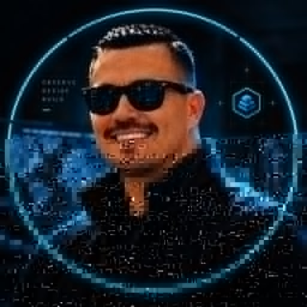

<p align="center">
  
</p>

<p align="center">
  <strong>JOE // COMMAND</strong><br/>
  Physical Risk Intelligence • Agentic AI • Cybersecurity • Insurance • Autonomous Systems
</p>

```text
┌────────────────────────────────────────────────────────────────────┐
│ joe@command:~$ boot                                                │
├────────────────────────────────────────────────────────────────────┤
│ USER        Joe Murillo                                            │
│ ROLE        Physical Risk Intelligence Architect                   │
│ MISSION      Build intelligence infrastructure for the physical     │
│              world — governed, observable, auditable, reversible.   │
│ STATUS       BUILDING                                              │
│ PROTOCOL     OBSERVE → DECIDE → VERIFY → LEARN                     │
└────────────────────────────────────────────────────────────────────┘
```

## `joe@command:~$ neofetch`

```text
                 ╭──────────────────────────────╮
             ╭───┤ JOE // INTELLIGENCE SYSTEMS ├───╮
             │   ╰──────────────────────────────╯   │
             │                                       │
             │          ┌───────────────┐            │
             │          │     XORIS     │            │
             │          │   CONTROL     │            │
             │          └──────┬────────┘            │
             │                 │                     │
             │        ┌────────▼────────┐             │
             │        │      ARIS       │             │
             │        │  INTELLIGENCE   │             │
             │        └────────┬────────┘             │
             │                 │                     │
             │       ┌─────────▼─────────┐            │
             │       │      CENTRA       │            │
             │       │  PHYSICAL / EDGE  │            │
             │       └───────────────────┘            │
             ╰────────────────────────────────────────╯

joe@command
----------------------------------------------------------------------
OS:              Human + Machine Intelligence Stack
Role:            Physical Risk Intelligence Architect
Focus:           Agentic AI / Cybersecurity / Insurance / Physical Risk
Current Build:   ARIS / XORIS / CENTRA / Physical Risk Graph
Node_01:         SENTINEL — Linux / Omarchy
Node_02:         WINDOWS — enterprise + engineering plane
Infra:           Docker / WSL2 / SSH / Tailscale
Data:            PostgreSQL / Supabase / Dataverse
Interface:       GitHub / VS Code / Next.js / Power Platform
Doctrine:        Human authority > agent authority
```

## `joe@command:~$ cat mission.txt`

Build the intelligence infrastructure that allows humans and machines to **understand, measure, govern, and reduce physical risk**.

```text
OBSERVATION
    ↓
RISK INTERPRETATION
    ↓
DECISION
    ↓
REMEDIATION / ACTION
    ↓
VERIFICATION
    ↓
OUTCOME
    ↓
PHYSICAL RISK GRAPH
```

The long-term compounding asset is not a specific model, drone, or application. It is the continuously improving **Physical Risk Graph** created from governed observations, decisions, remediation, verification, and outcomes.

## `joe@command:~$ tree ./systems -L 3`

```text
systems
├── XORIS
│   ├── role ........ governance / control plane
│   ├── owns ........ identity / missions / policy / approvals
│   ├── trust ....... audit / quarantine / kill switch
│   └── status ...... ARCHITECTURE
│
├── ARIS
│   ├── role ........ intelligence / decision plane
│   ├── ATLAS ....... what is true
│   ├── PRAXIS ...... what should be done
│   ├── SENTINEL .... adversarial challenge / confidence / security
│   └── status ...... ACTIVE
│
└── CENTRA
    ├── role ........ physical / edge plane
    ├── endpoints ... drones / sensors / computer vision / robotics
    ├── purpose ..... observe / locate / act / verify
    └── status ...... PLANNED
```

## `joe@command:~$ show_nodes`

```text
NODE 01  SENTINEL   Linux / Omarchy          ONLINE
         └─ security • infrastructure • SSH • Tailscale

NODE 02  WINDOWS    Microsoft / Enterprise   ACTIVE
         └─ GitHub • VS Code • Copilot • Power Platform • Azure

NODE 03  macOS      Apple dev cockpit        PLANNED
NODE 04  ATLAS      AI / GPU compute         PLANNED
NODE 05  VAULT      storage / artifacts      PLANNED
NODE 06  CENTRA     physical / edge          PLANNED
NODE 07  MOBILE     iPhone / iPad ops        ACTIVE
NODE 08  LAB        adversarial sandbox      PLANNED
```

## `joe@command:~$ ls ./spotlight`

| System | Mission |
|---|---|
| [`ARIS`](https://github.com/joemurillo-ai/aris) | Governed mission execution, authorization, lifecycle policy, audit, and agent-ready engineering |
| [`XORIS`](https://github.com/joemurillo-ai/xoris-ai) | Governance and control-plane architecture |
| [`PCAP Triage Pipeline`](https://github.com/joemurillo-ai/pcap-triage-pipeline) | Network evidence → analysis → incident-ready reporting |
| [`Azure AI Security Briefing Agent`](https://github.com/joemurillo-ai/azure-ai-security-briefing-agent) | AI-powered security briefing workflows |
| [`Human.exe`](https://github.com/joemurillo-ai/humanexe) | Human execution and workflow experiments |

## `joe@command:~$ status --public`

```text
ARIS
├── mission lifecycle policy ................. ONLINE
├── durable governance history ............... ONLINE
├── mission-agent authorization .............. ONLINE
├── diagnostic redaction ..................... ONLINE
├── engineering mission queue ................ ONLINE
└── broader execution plane .................. BUILDING

XORIS
├── agent identity / passports ............... DESIGN
├── mission authority ........................ DESIGN
├── capability control ....................... DESIGN
├── human approvals .......................... DESIGN
├── trust / quarantine / kill switch ......... DESIGN
└── observability / audit integration ........ DESIGN

CENTRA
├── field sensing ............................ PLANNED
├── drone endpoints .......................... PLANNED
├── computer vision .......................... PLANNED
└── outcome verification ..................... PLANNED
```

## `joe@command:~$ cat doctrine.txt`

```text
01  BUILD DIGITAL TWINS OF FUNCTIONS — NOT DIGITAL TWINS OF PEOPLE.
02  HUMAN AUTHORITY > AGENT AUTHORITY.
03  NO AUTONOMY WITHOUT IDENTITY, POLICY, AUTHORIZATION,
    OBSERVABILITY, AUDIT, AND REVERSIBILITY.
04  THE DRONE IS A SENSOR.
05  THE MODEL IS A PERCEPTION LAYER.
06  VERIFIED OUTCOME DATA COMPOUNDS.
```

## `joe@command:~$ ./contribution_signal`

<picture>
  <source media="(prefers-color-scheme: dark)" srcset="https://raw.githubusercontent.com/joemurillo-ai/joemurillo-ai/output/github-contribution-grid-snake-dark.svg">
  <source media="(prefers-color-scheme: light)" srcset="https://raw.githubusercontent.com/joemurillo-ai/joemurillo-ai/output/github-contribution-grid-snake.svg">
  
</picture>

## `joe@command:~$ contact --show`

```text
GitHub     github.com/joemurillo-ai
LinkedIn   linkedin.com/in/joemurillo
Email      info@joemurillo.com
```

<p align="center">
  <sub>JOE // COMMAND v2.1 • public systems surface • live vs planned state is explicitly labeled</sub>
</p>
